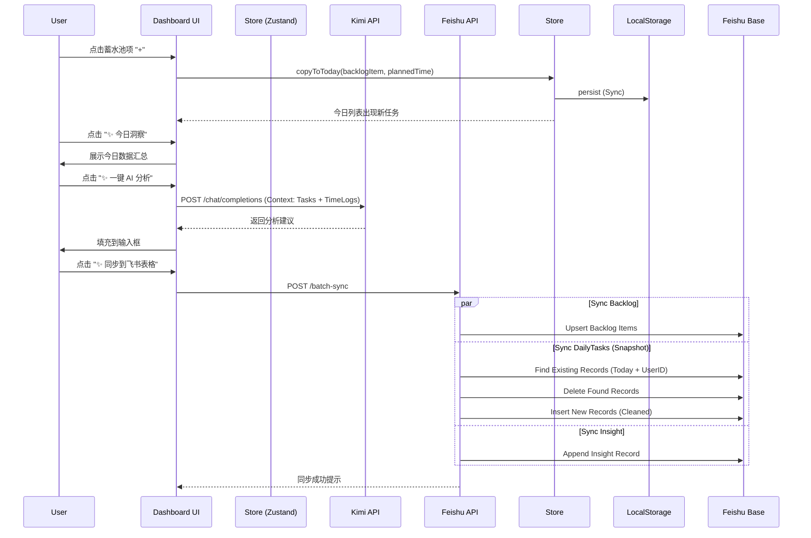

# 产品需求文档 (PRD) - Personal Growth OS

## 版本记录 (Version History)
| 版本 | 日期 | 更新内容 | 状态 |
| :--- | :--- | :--- | :--- |
| **V1.3** | 2026-03-11 | **交互优化与AI升级**。<br>1. **时间控件重构**：支持直接数字输入（HH:MM）+ 自定义简约时间选择器（替代原生picker）；智能跳转（输入2位后自动跳到分钟）；智能补零（输入>2自动补0）。<br>2. **今日计划拖拽排序**：支持拖拽调整今日任务优先级顺序。<br>3. **关联功能完善**：实际时间记录新增”关联蓄水池”下拉框。<br>4. **AI洞察精简**：输出更简短（3段），深度洞察整合为1段，语气更友好温暖。<br>5. **错误提示优化**：飞书权限错误(91403)给出明确的中文操作指引。 | **Current** |
| V1.2.3 | 2026-03-08 | **文案与空状态优化**。<br>1. **文案升级**：今日计划与时间记录空状态采用更具启发性的引导语。<br>2. **视觉减负**：简化空状态样式，去除冗余描述，使用中性灰色。 | 已发布 |
| V1.2.2 | 2026-03-08 | **计划与记录增强**。<br>1. **快捷关联**：今日计划添加时支持直接选择蓄水池母任务。<br>2. **分类管理**：支持”生活/工作/成长/其他”分类修改（今日计划 & 时间记录）。<br>3. **智能记录**：完成任务时优先使用计划时间或描述中的时间，而非点击时刻。 | 已发布 |
| V1.2.1 | 2026-03-08 | **体验与流程优化**。<br>1. **自动记录**：今日计划任务完成后，自动创建一条默认的实际时间记录。<br>2. **文案优化**：每日洞察同步说明文案更新，视觉轻量化。<br>3. **UI 细节**：仪表盘日期格式对齐优化。 | 已发布 |
| V1.1 | 2026-03-07 | **每日洞察与 AI 教练**。<br>1. **每日洞察**：全新复盘模块，支持 AI (Kimi) 一键生成日报分析。<br>2. **智能同步**：基于快照策略 (Snapshot) 的飞书同步，自动去重，确保数据 1:1 精准备份。<br>3. **数据清洗**：严格过滤幽灵任务，仅同步”计划内”或”有实际产出”的任务。<br>4. **体验优化**：主页文案优化，Dashboard 交互升级。 | 已发布 |
| V1.0 | 2026-03-07 | **正式发布版本**。<br>1. **核心闭环**：蓄水池 -> 今日计划 -> 时间记录 -> 历史回顾。<br>2. **云端同步**：集成飞书多维表格，支持多用户隔离与数据云备份。<br>3. **交互完善**：支持拖拽排序、行内编辑、可视化时间统计、主页导航。<br>4. **架构升级**：Local-First + Cloud Backup (BaaS)。 | 已发布 |
| v0.2 | 2026-03-07 | 多用户与云同步 (Beta)。 | 已合并 |
| v0.1 | 2026-03-07 | MVP 功能验证。 | 已合并 |

## 1. 产品愿景与路线图 (Product Roadmap)

### 核心目标 (Mission)
打造一款 **以“个人成长”为核心操作系统**。不仅仅是记录任务，更是通过 **“蓄水池 -> 每日聚焦 -> 真实记录 -> 复盘洞察”** 的闭环，帮助终身学习者在繁忙的工作中，夺回属于自己的成长时间，实现工作与生活的动态平衡。

### 用户画像 (Persona)
*   **目标用户**：终身学习者、职场进阶者、独立开发者。
*   **核心痛点**：
    *   **被动工作**：日常被琐事填满，忘记了长期的成长目标。
    *   **时间黑洞**：感觉忙了一天，但不知道时间具体花哪了。
    *   **缺乏反馈**：只有“做没做完”，没有“做得怎么样”和“平衡得如何”的反馈。

### V1.0/V1.1: 正式版功能 (Official Release)
*目标：提供稳定、完整、可扩展的个人成长管理闭环。*

1.  **蓄水池 (Backlog) - 长期指引**：
    *   **定义**：月度/季度维度的目标池（如“阅读《原则》”、“完成 Q3 报表”）。
    *   **交互**：
        *   **CRUD**：支持鼠标悬停后**编辑**（标题/目标日期）、**删除**、**完成**（归档）。
        *   **拖拽排序**：支持长按拖动调整任务优先级。
        *   **目标日期**：支持填写预期的 **“目标日期”**（如 "2026年4月"），以标签展示。
    *   **指引作用**：支持从蓄水池“引用”任务到今日计划（**复制/实例化**，而非移动）。蓄水池中的母任务保留，今日计划生成一个执行子任务。
2.  **今日聚焦 (Today's Focus) - 每日执行**：
    *   **定义**：今日的执行清单。
    *   **计划时间**：新增任务时（无论是从蓄水池引入还是临时添加），支持选填 **“计划时间段”**（如 14:00-15:00）。
    *   **交互**：
        *   支持**行内编辑**（点击任务直接修改标题/时间/**分类**）。
        *   支持**删除**今日计划项（不影响蓄水池原任务）。
        *   **快捷关联 (Quick Link)** (V1.2.2 New)：在底部“添加一个任务”的快速输入栏中，增加“关联蓄水池”的下拉选择，允许直接创建关联任务。
    *   **分类管理 (Category)** (V1.2.2 New)：支持在添加/编辑任务时选择 **“其他”** 分类，以覆盖非成长/工作/生活的杂项事务。注意：蓄水池仍保持原有三类，不引入“其他”。
    *   **目标**：每天早上列清单时，不仅定内容，还定时间，锁定高优先级事务的执行窗口。
    *   **自动记录 (Auto Log)** (V1.2 New)：
        *   当用户在“今日计划”中勾选完成任务时，系统自动在“实际时间记录”中创建一条记录。
        *   **智能时间推断** (V1.2.2 Update)：
            *   Priority 1: 使用任务的 `plannedTime` 字段（如 "14:00-15:00"）。
            *   Priority 2: 尝试从任务标题/描述中解析时间模式（如 "10:00-11:00 开会"）。
            *   Priority 3: 若均无，默认记录为当前时间前1小时至当前时间（作为兜底，用户需手动修正）。
            *   **Key**: 绝不简单使用“点击完成那一刻”作为结束时间，而是优先尊重计划。
        *   用户可后续手动调整时间。
3.  **时间记录 (Time Log) - 真实反馈**：
    *   **分类修改** (V1.2.2 New)：支持在时间记录列表中直接修改记录的分类（Work/Growth/Life/Other），该修改会同步更新关联任务的分类。
    *   **手动录入**：不再使用计时器。用户输入具体的 **“开始时间 - 结束时间”**（如 10:00-11:00）以及内容备注。
    *   **非计划任务 (Unplanned)**：如果直接在时间记录栏添加（未关联今日计划），该任务会被标记为“非计划”，并且 **不会** 自动添加到“今日计划”列表中干扰视线，但会带有“非计划”标签出现在时间轴中。
    *   **展示**：形成一条清晰的“今日实际时间轴”，并在顶部展示可视化的 **Work/Growth/Life/Other** 时间平衡条。
4.  **每日洞察 (Daily Insight) - AI 赋能** (V1.1 New)：
    *   **入口**：Dashboard 顶部及右下角“✨ 今日洞察”按钮。
    *   **功能**：展示当日 Work/Growth/Life/Other 投入统计。
    *   **AI 分析**：集成 Kimi (Moonshot) 大模型，一键生成效率点评与改进建议。
    *   **同步**：将今日数据快照同步至飞书。
5.  **多用户与云同步 (Multi-user & Cloud Sync)**：
    *   **多用户隔离**：引入 `userId` 概念，支持前端切换身份，数据完全隔离。
    *   **飞书集成**：
        *   **配置**：支持配置 AppID/Secret/BaseToken 及 **Kimi API Key**。
        *   **自动建表**：系统自动检测并创建 `Tasks`、`TimeLogs`、`Insights` 表。
        *   **快照同步**：采用“先删后增”策略，确保云端数据与本地状态完全一致，无重复、无幽灵数据。

### V2 及以后版本 (Future Releases)
1.  **日历视图集成**：将任务直接拖拽到时间轴进行排程。
2.  **多端同步**：引入后端数据库，支持手机/桌面端实时同步。
3.  **周/月度深度报告**：生成成长曲线图，分析长期趋势。

---

## 2. 核心业务逻辑与数据契约

### 关键业务规则 (Business Rules)
1.  **蓄水池与今日的关系 (Reference vs Move)**：
    *   **操作**：当用户点击蓄水池任务的“+”时，系统在今日列表创建一个**新任务**。
    *   **关联**：新任务可以记录来源（Parent ID），但两者状态独立。今日任务完成不代表蓄水池任务完成（例如“写书”在蓄水池，“写第一章”在今日）。
    *   **完成逻辑**：蓄水池任务需要用户手动在侧边栏点击“归档/完成”才会消失。
2.  **计划时间 (Planned Time)**：
    *   用户在添加任务到今日时，可以输入一个可选的时间范围（字符串格式即可，如 "14:00-15:00"）。这只是一个文本指引，不强制逻辑校验。
3.  **时间记录逻辑 (Actual Log)**：
    *   记录的是 **“真实发生”** 的事情。
    *   输入格式明确为：开始时间（HH:mm）- 结束时间（HH:mm）。系统自动计算时长。
    *   **非计划标记**：通过快速录入栏创建的任务，`isUnplanned` 属性设为 `true`。
4.  **平衡性计算**：
    *   `Balance Score` = (Growth Time + Life Time) / Total Time。
5.  **云同步策略 (Cloud Sync Strategy)** - V1.1 更新：
    *   **Mode**: 快照同步 (Snapshot Sync)。
    *   **Trigger**: 用户在“每日洞察”窗口点击“同步到飞书表格”时触发。
    *   **Logic**: 
        1.  **Backlog**: 全量 Upsert（更新或插入）蓄水池中未归档任务。
        2.  **DailyTasks**: **先删除**今日该用户的所有旧记录，**后批量插入**最新记录（去重）。
        3.  **DailyInsight**: 追加写入今日的复盘与 AI 分析结果。
    *   **Filter**: 仅同步“计划内任务”或“有实际时间记录的任务”，严格过滤“非计划且无记录”的幽灵任务。

### 数据契约 (Data Contract)

#### 1. 任务对象 (TodoItem)
```typescript
interface TodoItem {
  id: string;
  userId: string; // 用户标识，用于多用户隔离
  title: string;
  category: 'work' | 'growth' | 'life' | 'other';
  status: 'backlog' | 'todo' | 'done'; 
  parentId?: string; // 关联蓄水池母任务ID
  plannedTime?: string; // 计划时间段，如 "14:00-15:00"
  targetDate?: string;  // 蓄水池目标日期，如 "2026-04"
  isUnplanned?: boolean; // 是否为非计划任务
  createdAt: number;
  completedAt?: number;
}
```

#### 2. 时间记录 (TimeLog)
```typescript
interface TimeLog {
  id: string;
  userId: string;      // 用户标识
  taskId: string;      // 关联哪个任务
  startTimeStr: string; // "10:00"
  endTimeStr: string;   // "11:00"
  duration: number;    // 分钟数 (计算得出)
  note?: string;       // 可选备注
  createdAt: number;
}
```

#### 3. 配置对象 (SyncConfig)
```typescript
interface SyncConfig {
  userId: string;
  larkAppId?: string;
  larkAppSecret?: string;
  larkBaseToken?: string;
  kimiApiKey?: string; // V1.1 New: Kimi AI Key
}
```

---

## 3. V1.0/V1.1 概念原型 (ASCII)

### Settings & Login 视图
```ascii
+---------------------------------------------------------------+
|  [< Back] 设置 & 云同步                                       |
+---------------------------------------------------------------+
|  👤 用户身份 (User Profile)                                   |
|  当前用户: [ baoxiaoxi ]                                      |
|  (数据将通过此 ID 进行隔离)                                   |
|                                                               |
|  ☁️ 飞书云同步 (Lark Base Sync) [Beta]                        |
|  App ID:     [ cli_a1b2c3d4...       ]                        |
|  App Secret: [ ********************* ]                        |
|  Base Token: [ N8s7d6f5g4h3...       ]                        |
|                                                               |
|  🤖 AI 助手 (Kimi) [New]                                      |
|  Kimi API Key: [ sk-**************** ]                        |
|                                                               |
|  -----------------------------------------------------------  |
|  [ 🔄 测试连接 ]    [ 💾 保存配置 ]                           |
+---------------------------------------------------------------+
```

### Dashboard 视图
```ascii
+---------------------------------------------------------------+
|  [Logo] GrowthOS           [📅 3月8日 星期日] [✨ 今日洞察]   |
+---------------------------------------------------------------+
|  🌊 蓄水池 (长期指引)      |  🔥 今日聚焦 (执行与记录)      [🏠] |
|  [+ Add Goal]              |  [+ Quick Add Task]               |
|  (支持拖拽排序)            |  [Input Title] [Time] [Link] [Cat]|
|                            |  (New: 支持直接关联蓄水池)        |
|  📂 成长 (Growth)          |                                   |
|  [ ] 学习 Rust 基础        |  📋 今日计划 (Plan):              |
|      🎯 2026-04            |  [ ] 学习 Rust (第3章) [✏️]       |
|      [Edit][Del][Done]     |      ⏰ 计划: 20:00-21:00         |
|      [+ Add to Today]      |      �️ [Growth v] (可修改)       |
|                            |      (来源: 学习 Rust 基础)       |
|  📂 工作 (Work)            |      [Del]                        |
|  [ ] Q3 季度报表           |                                   |
|      🎯 2026-03            |  [ ] 修复 Bug #123 (Work)         |
|                            |      ⏰ 计划: 10:00-11:00         |
|                            |      [Record Time]                |
|                            |                                   |
|                            |  -------------------------------  |
|                            |  ✅ 实际时间记录 (Actual):        |
|                            |  [+ Quick Log] (10:00-11:00)      |
|                            |                                   |
|                            |  • 10:00-11:00 [Work v] 开会      |
|                            |    (关联任务: 修复 Bug #123)      |
|                            |    [Edit][Del]                    |
|                            |                                   |
+----------------------------+-----------------------------------+
|  (点击完成仅归档蓄水池项)  |  💡 Balance: Work 2小时 | Growth 2小时|
+----------------------------+-----------------------------------+
```

### Daily Insight Modal (每日洞察弹窗)
```ascii
+---------------------------------------------------------------+
|  ✨ 每日洞察 (2026-03-07)                               [X]   |
+---------------------------------------------------------------+
|  [ 总投入 8h ]  [ 工作 6h ]  [ 成长 1h ]  [ 生活 1h ]         |
+---------------------------------------------------------------+
|  ✅ 今日完成                                                  |
|  • 完成 PGO 前端页面开发                                      |
|  • 修复数据库打通                                             |
+---------------------------------------------------------------+
|  💭 洞察与反思                                 [✨ 一键 AI 分析]|
|  +---------------------------------------------------------+  |
|  | 【今日分析】                                            |  |
|  | 工作效率很高，但成长投入略显不足...                     |  |
|  | 【改进建议】                                            |  |
|  | ...                                                     |  |
|  +---------------------------------------------------------+  |
+---------------------------------------------------------------+
|  🔄 同步说明                                                  |
|  • 点击同步后，系统将同步数据至飞书多维表格，             |
|    实现长期数据沉淀                                           |
+---------------------------------------------------------------+
|            [ ✨ 同步到飞书表格 ]                              |
+---------------------------------------------------------------+
```

---

## 4. 架构设计蓝图 (Architecture Blueprint)

### 4.1 核心流程图 (Mermaid)



### V1.1: 每日洞察与智能日结 (Daily Insight & Smart Settlement) - Implemented
*目标：通过“日结”机制，将经过确认的、高质量的“结果数据”沉淀到飞书，便于长期复盘分析。*

1.  **同步策略 (Sync Strategy)**
    *   **Local-First**: 日常操作仅在本地 LocalStorage 进行，保证极致响应速度。
    *   **Snapshot Sync**: 仅在用户点击同步时触发。
    *   **De-duplication**: 针对每日任务表 (DailyTasks)，采用 **Delete-then-Insert** 策略，确保云端数据始终是本地数据的精确快照，解决重复和脏数据问题。

2.  **飞书数据表结构设计 (Schema)**

    **Sheet 1: 蓄水池 (Backlog)**
    *   *用途：记录所有待办任务的最新状态。*
    *   **TaskID** (文本): 唯一标识
    *   **AddedDate** (数字/时间戳): 添加时间
    *   **Content** (文本): 任务内容/标题
    *   **Category** (文本): 成长 / 工作 / 生活
    *   **TargetDate** (文本): 目标截止时间
    *   **Status** (文本): backlog / todo / done

    **Sheet 2: 每日任务情况 (DailyTasks)**
    *   *用途：记录每一天的具体执行情况。*
    *   **Date** (数字/时间戳): 核心分析维度 (Midnight Timestamp)
    *   **TaskContent** (文本): 任务内容
    *   **Category** (文本): 成长 / 工作 / 生活 / 其他
    *   **PlannedTime** (文本): 计划时间段
    *   **IsCompleted** (文本): 是 / 否
    *   **ActualTimeRange** (文本): 实际时间段
    *   **ActualDuration** (数字): 实际花费分钟数
    *   **IsUnplanned** (标签): "临时新增" / "计划内"

    **Sheet 3: 每日洞察 (DailyInsight)**
    *   *用途：记录每日复盘与 AI 分析结果。*
    *   **Date** (数字/时间戳): 日期
    *   **Insight** (文本): 复盘内容 (包含 AI 分析)
    *   **Score** (数字): 自我评分 (1-5)

3.  **价值**
    *   **减少噪点**：飞书上不会有中间态的垃圾数据。
    *   **智能赋能**：引入 AI 教练，让复盘不再是流水账，而是真正的成长反馈。

### AI 教练提示词设计 (System Prompt) - V1.3 Update

**Role**: 你是一位温暖且睿智的成长伙伴，擅长从数据中发现亮点和成长机会。

**Instruction**:
基于用户的【蓄水池(长期目标)】、【今日时间投入】和【完成任务】，生成简短有力的每日洞察。

分析框架（内部思考，不要输出）：
1. 先找亮点：今天做得好的地方是什么？
2. 再看机会：与长期目标对比，哪里有提升空间？
3. 挖掘本质：背后可能的原因或模式是什么？
4. 区分日期：工作日关注成长时间是否被挤压；休息日关注生活和恢复是否充足

**Output Format**:
严格按以下格式，每个部分控制在1-3句话：

📊 今日一览
[先肯定一个具体亮点，再用"同时"或"接下来可以"引出一个成长机会。语气积极。]

💡 核心洞察
[选择最值得关注的1个发现，将时间分配、任务选择、效率模式等融合成一段流畅的分析。聚焦"为什么"和"意味着什么"，而非罗列数据。]

🎯 明日一步
[给出1条最关键的、具体可操作的小建议。用"可以试试"、"建议"等温和语气。]

**Tone**:
- 像朋友聊天，不像汇报或说教
- 用"你"而非"您"，简短句子
- 问题说成"机会"或"空间"
- 数据点到为止，重在洞察
- 结尾传递信心
